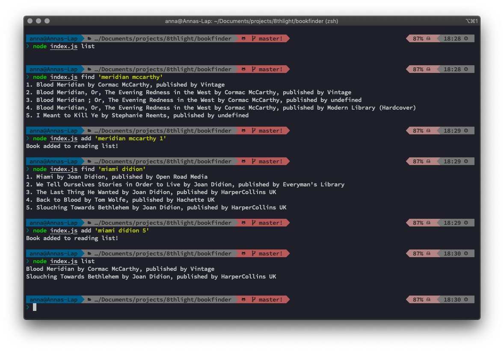

# 📚🧐 Bookfinder 

Bookfinder is a command-line only app in JavaScript and Node that lets you search for books and add them to a reading list.

**NOTE:** to successfully run this app you need to use your own [Google Books API key](https://developers.google.com/books/docs/v1/using#APIKey). Once you got your key, you can use it in Bookfinder to make API calls. Here are the options:

* replace the KEY variable on top of the `commands.js` file 
* install dotenv by running `$ npm install dotenv`. Create your own `.env` file in the project directory, and add your API key in the file, like so: `BOOKS_KEY=rAnDoMcHaRaCtErSoFyOuRbOoKsApIkEy`
* add it to your bash profile as an environment variable; that way you can use it in all your projects by calling the variable from any location. In your code editor, open `~/.bash_profile` and add the API key as an environment variable: 

```
export BOOKS_API="rAnDoMcHaRaCtErSoFyOuRbOoKsApIkEy"
```
          
   
### Download or clone this repo. 

Navigate into the project directory and run `$ npm install`.

**Run tests with `$ npm test`**
   
### Search for books

You can use any search terms you want to find books. For example, to find a book by title and author use `$ node index.js find '<title> <author>'`, like so:

```
$ node index.js find 'meridian mccarthy'
```

You should see the following results:

```
1. Blood Meridian by Cormac McCarthy, published by Vintage
2. Blood Meridian, Or, The Evening Redness in the West by Cormac McCarthy, published by Vintage
3. Blood Meridian ; Or, The Evening Redness in the West by Cormac McCarthy, published by undefined
4. Blood Meridian, Or, The Evening Redness in the West by Cormac McCarthy, published by Modern Library (Hardcover)
5. I Meant to Kill Ye by Stephanie Reents, published by undefined
```

You're free to use however many keywords for title, authors or both. Note that you'll only ever see top 5 results for the given queries.

### Choose a book to add to your reading list

Use the `add` command, the search queries you'd used and your chosen book's list position:

```
$ node index.js add 'meridian mccarthy 1'
```

### View your reading list

* view it in the command line with `$ node index.js list` 
* you can also open `reading-list.txt` file found in the project directory in your favourite text editor.

## Demo


---

## Known issues

* incomplete error handling for fetched objects that include undefined values
* incomplete testing for the aforementioned errors
* private methods not unit tested
* no error handling for missing API key

